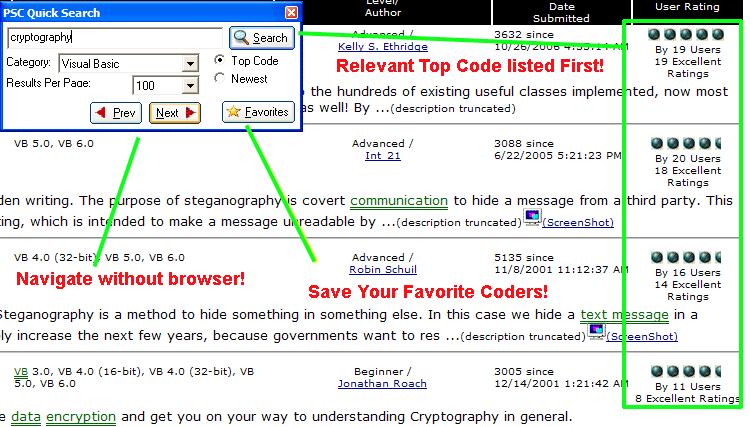



## Unique Tool to Search &amp; Download Top Code on PSC

### Description

Unique Tool to Search For Top Code on PSC

This is a tool created to accompany an article I posted on here which explains a simple tip for retrieving the top code related to your search keywords. Now although the code may seem simple to many of you expert coders on here, take note that it's not so much the code but the way in which it queries the website. Never before have you been able to search for a keyword on PSC and have it display top rated code related directly to what you are searching. Sounds strange doesn't it? Well granted you can search for popular code on here, it's not the same as "top rated" code since popular code is just code that has been viewed lots of times. Why don't you just give it a try and you will instantly see what I'm talking about. I promise you will not regret such a powerful way of searching. Oh and ofcourse, please vote if you like it. =)

Here is the short article explaining the secret:

http://www.planet-source-code.com/vb/scripts/ShowCode.asp?txtCodeId=67031&amp;lngWId=1

Updates

12/16/2007 - Author View Bug Fix

12/15/2006 - New mini mode

12/05/2006 - Wow! DL Multiple Code

11/30/2006 - Added ability to Retain Log-In

- Added Systray Icon

11/22/2006 - New Options Button

- Lavolpe Buttons
 
### More Info
 

             |
---                |---
**Submitted On**   |2006-12-16 03:11:04
**By**             |[Dreamcoding](https://github.com/Planet-Source-Code/PSCIndex/blob/master/ByAuthor/dreamcoding.md)
**Level**          |Intermediate
**User Rating**    |4.9 (153 globes from 31 users)
**Compatibility**  |VB 5\.0, VB 6\.0
**Category**       |[Internet/ HTML](https://github.com/Planet-Source-Code/PSCIndex/blob/master/ByCategory/internet-html__1-34.md)
**World**          |[Visual Basic](https://github.com/Planet-Source-Code/PSCIndex/blob/master/ByWorld/visual-basic.md)
**Archive File**   |[Unique\_Too20380012162006\.zip](https://github.com/Planet-Source-Code/dreamcoding-unique-tool-to-search-amp-download-top-code-on-psc__1-67033/archive/master.zip)

